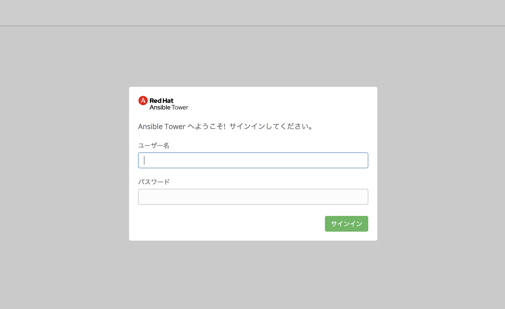

# 演習1 - Ansible Towerのインストール

[前に戻る](../engine/ex5.html)

------

この演習では、あなたのコントロールノードへAnsible Towerのインストールを実行します。

## Ansible Towerとは？

Ansible TowerはAnsibleによる自動化プラットフォームであり、Ansible Engineだけでは実現できない、

* Web GUI
* REST API
* ジョブの予約実行
* 複数のplaybookを組み合わせて作成できるWorkflowテンプレート
* 権限管理
* ログ集約

といった機能を提供しています。

## Ansible Towerのインストール


### Step 1:

AnsibleコントロールノードにSSHログインし、ホームディレクトリ へ移動してください。

```bash
$ cd
```

### Step 2:

Ansible Tower 3.5.0 の packageをダウンロードします。

```bash
$ curl -O https://releases.ansible.com/ansible-tower/setup/ansible-tower-setup-3.5.0-1.tar.gz
```

### Step 3:

ダウンロードしたパッケージファイルの Untar と unzip を実行します。

```bash
$ tar xvfz ./ansible-tower-setup-3.5.0-1.tar.gz
```

### Step 4:

Ansible Towerパッケージを解凍したディレクトリへ移動します。

```bash
$ cd ./ansible-tower-setup-3.5.0-1/
```

### Step 5:

インストーラに同梱されているinventoryファイルをエディタで編集します。

```bash
$ vi inventory
```

### Step 6:

inventoryファイル内で、AnsibleTowerが必要とするパスワードを変数として追加します。
以下の3つへ任意のパスワード情報を記述してください。:
`admin_password, pg_password, rabbitmq_password`

ここの例では全て `ansibleWS` としています。
`admin_password` はAnsible Towerへのログインに使用するために必要です。

```ini
[tower]
localhost ansible_connection=local

[database]

[all:vars]
admin_password='ansibleWS'

pg_host=''
pg_port=''

pg_database='awx'
pg_username='awx'
pg_password='ansibleWS'

rabbitmq_username=tower
rabbitmq_password='ansibleWS'
rabbitmq_cookie=cookiemonster

# Isolated Tower nodes automatically generate an RSA key for authentication;
# To disable this behavior, set this value to false
# isolated_key_generation=true
```

### Step 7:

Ansible Tower のセットアップスクリプトを実行します。

```bash
sudo ./setup.sh
```

---
**NOTE**
Step 7 のセットアップスクリプトの完了までにはネットワーク状況にもよりますが、10-15分ほど時間がかかります。

---


### 結果

セットアップスクリプトがfail=0で終了している場合、あなたのAnsible Towerのインストレーションは無事に完了しているはずです。
Google ChromeかFirefoxを使ってAnsible Towerへアクセスしてみましょう。


```bash
https://コントローラーノードのIPアドレス
```

### インストール結果の確認
Towerはインストール時に自動生成された自己署名証明書でHTTPS通信を行いますので、ブラウザでの確認時に証明書エラーが表示されることがあります。その場合は、例外に追加してページを表示できるようにしてください。
以下のようなAnsible TowerのGUIが確認できれば、インストール結果の確認までが完了しました。



---

[次に進む](./ex2.html)